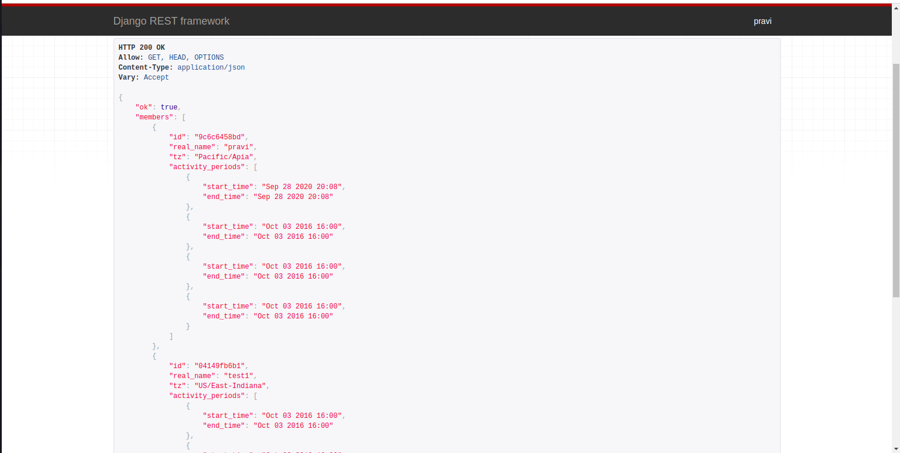
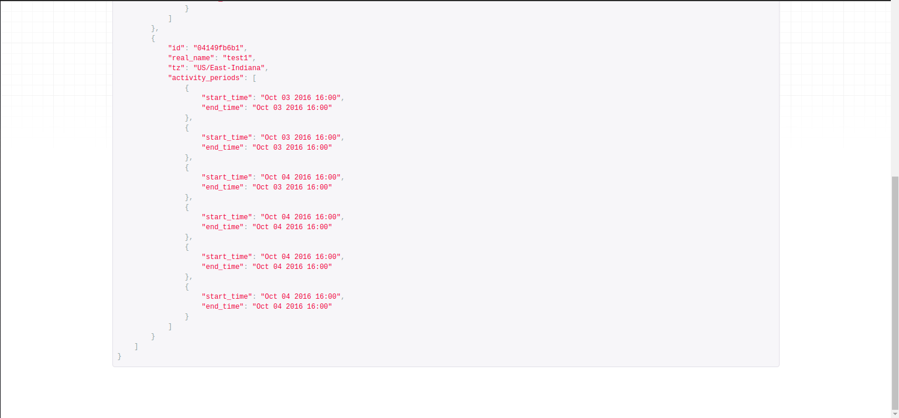

## Fullthrottle labs
Project for creating members and login data

## Installation
install virtual env and activate the env,
install required libraries from requirements.txt
```bash
pip3 install -r requirements.txt
```

# dump data to database
```bash
python manage.py loaddata db.json 
```

## URLS
For getting data
```bash
http://localhost:8000/users/data/
```
For post method (create login data for each user)
```bash
http://localhost:8000/users/logindata/
```
Body of request
```bash
{
  "start_time": "2016-10-04T19:00:00+0200",
  "end_time": "2016-10-04T19:00:00+0200",
  "user": "04149fb6b1"
}
```

For creating members
```bash
http://localhost:8000/users/data/
```
body of the request
```bash
  {
  "password" : "test@1234",
  "real_name": "test3",
  "tz": "Pacific/Apia"
  }
```
For add or update data using Django-admin
```bash
http://localhost:8000/admin
```
Username : test
password : test@1234

# Screenshots


